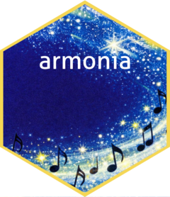

# armonia <a href="https://icg-cat.github.io/armonia/"></a>

Tools for harmonizing multilingual and multi-wave research datasets. `armonia` generates an Excel-based data dictionary that maps raw variable names and categorical values to a standardized schema, applies that mapping to rename variables and recode factors, safely row-binds and column-binds waves, and anonymizes participant identifiers via salted SHA-256 hashing.

Real-world longitudinal studies collect data across multiple waves, often with different teams, questionnaire versions, or even languages. The result is a collection of data frames that should be equivalent but often aren't: column names differ, factor labels are in different languages, or values accumulate small typos over time. `armonia` handles this in four phases: build a dictionary, standardize each wave against it, assemble the waves into one dataset, and anonymize participant identifiers.

## Installation

`armonia` is not yet on CRAN. Until it is:

```r
library(devtools)
install_github("icg-cat/armonia")
```

## Quick example

`dict_init()` scans your waves and writes an Excel dictionary skeleton for you to review; `dict_apply()` then applies a reviewed dictionary to standardize a wave:

```r
library(armonia)

wave1 <- data.frame(id = c("alice", "bob"), gender = c("Female", "Male"))

dict_path <- tempfile(fileext = ".xlsx")
openxlsx::write.xlsx(
  list(
    Variable_Map_Wide = data.frame(target_name = c("id", "gender"), orig_w1 = c("id", "gender")),
    Factor_Levels = data.frame(
      wave = "orig_w1", original_variable = "gender", target_name = "gender",
      original_level = c("Female", "Male"), standard_code = c(1, 2), standard_label = c("Female", "Male")
    )
  ),
  file = dict_path
)

dict_apply(wave1, dict_path, source_name = "orig_w1")
```

## Learn more

The package vignette walks through the full four-phase workflow on a fictional longitudinal study:

```r
vignette("armonia")
```

## License

MIT. See `LICENSE.md` for the full text.

## AI Usage Disclosure

This package was developed with the assistance of Anthropic’s Claude (Sonnet 4.6) for the following tasks:

* Code revision, formatting, and general feedback
* Drafting warning messages
* Translating documentation from Spanish to English
* Generating `roxygen2` documentation examples and toy datasets
* Writing unit tests using `testthat`

All AI-generated code and text was reviewed, edited and tested by the human authors to ensure reliability.
